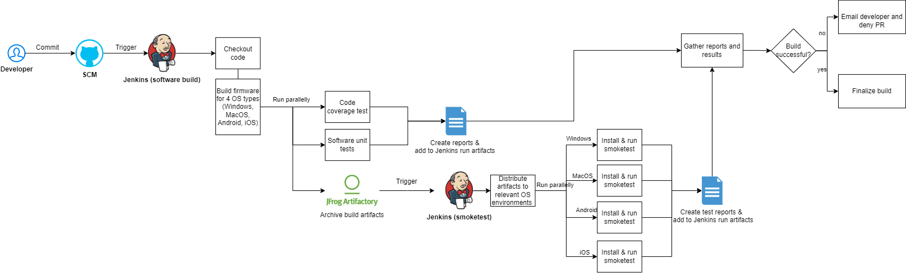

# Task 1. Code release process with device farm automation

For this purpose I would personally use CI/CD Pipelines with Jenkins.

## A) Analyze the flow, and prepare the pros and cons of the solution

**Flow Overview:**

My suggested flow would have these steps:

1.  **Code commit -** A developer commits code to the Source Code Management (SCM) system which triggers Jenkins run.
2.  **Build process -** The code is built for Windows, macOS, Android, and iOS in parallel.
3.  **Code testing -** Code coverage and unit tests are parallelly executed.
4.  **Archive artifacts -** Build artifacts are stored in Artifactory (JFrog or any other).
5.  **Smoketest preparation -** Jenkins triggers a separate smoketest job which distributes artifacts to OS environments.
6.  **Smoketest run -** Smoketests are run on real devices for each OS in parallel.
7.  **Report aggregation -** All reports from the jenkins run are aggregated and archived.
8.  **Build finalization -** The build status is finalized, and in case of failure email is sent to developer and PR can't be merged.

**Pros:**

* Automated deployment with automated testing reduces manual errors.
* This approach ensures consistency across all platforms.
* Easily extendable setup for additional OS versions or devices.
* Ensures that code which breaks software can't be merged to master.

**Cons:**
* This setup can be complex and hard to set up or maintain.
* Needs a lot of time investment with CI/CD tools.
* Builds might be stuck due to Jenkins or JFrog issues (dependency on another tools).

## B) Compare with other (more or less popular approaches/options)

| Approach | Pros | Cons |
|:----------:|:-------------:|:------:|
| Manual deployment | Simple for very small code changes and small systems | Time consuming and prone to errors |
| Docker containerization |    Easy to replicate same environment everywhere   |   Might be not supported by devices or OS |
| Simulator use for testing | Lower costs and faster setup | Might not acurately check all the issues that are related to the devices (we're planning to release it on the real device after all) |

## C) Justify why you picked that solution
This CI/CD approach would be the best solution in this case in my opinion because:

* All changes are checked and deployed automatically
* Can be scaled easily if more devices or OS are needed
* Provides all the (build) info for developers in case of any issues  

## D) Draw a simple diagram of the flow
Simple diagram created with the help of draw.io tool:
